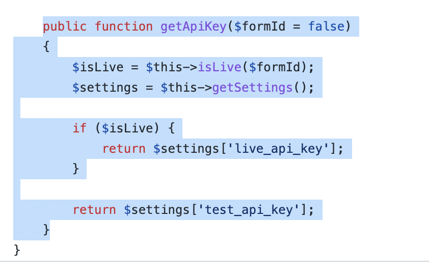

# mollie-for-paymattic
An example plugin for Paymattic payment module integrations.

# procedure of integrating a custom payment module with paymattic
Here we tried to show how to integrate a custom payment gateway with paymattic by showcasing payment gateway integration.

## module structure
- plugin file
- settings
- Api

### sample_payment_file.php
In the main plugin file of the custom payment you need to do some mandatory checks and use the desired <b>wppayform_loaded</b> hook to trigger integrating your custome module. 

Go through the <b>mollie-for-paymattic.php</b> file to get it clear.

### settings
To make your custom payment compatible and visible in paymattic you need to provide desired settings in a specific way. Setting constructed with two defferent file
- Element.php
- Settings.php

#### Element file
Element.php file where you make your custom payment as a paymattic component. This file basically extend the BaseComponent file of Paymattic and add the 
necessary hooks in the construct menthod.
 

Go through the <b>settings/MollieElement.php</b> and do exactly by replacing your custom payment name.

### settings file
settings.php file where you give all necessary global fileds to save the payments credentials: live/test public/secret keys to make your payment module actually works. This file need to extend the basepayment class of paymattic. implements all the function by replacing yours.

In this file where you need to be most careful is the <b>globalFields</b> function.
 

There are four, two(in some case, as here in mollie) credential field <b>type</b> whichs are not changeable.
- test_secret_key
- test_pub_key
- live_secret_key
- live_pub_key

But field key of credential fields you can give as your payment module requires. ex: for mollie you need <b>test_api_key</b> and <b>live_api_key</b>.

Make sure you get api key settings as you set keys on global fields.

rest, implement all the function as given on <b>settings/settings.php</b>

