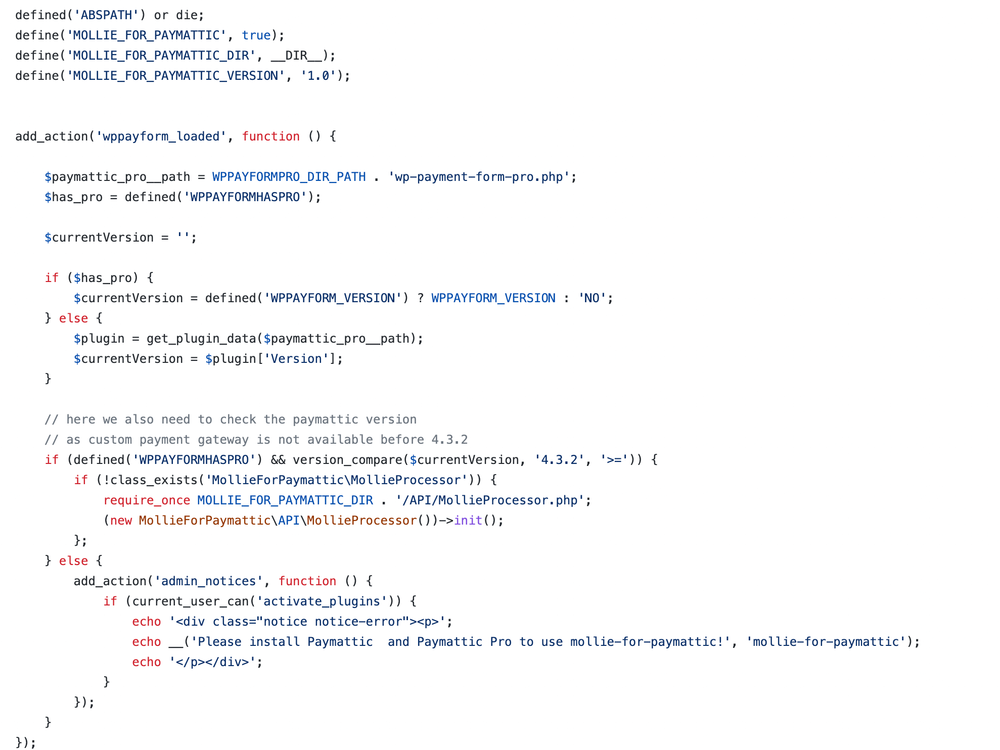
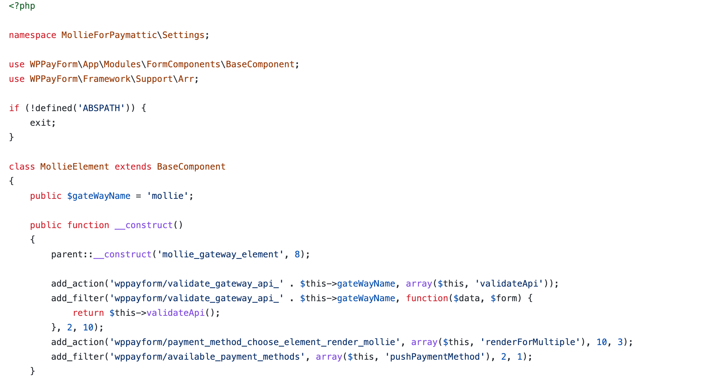
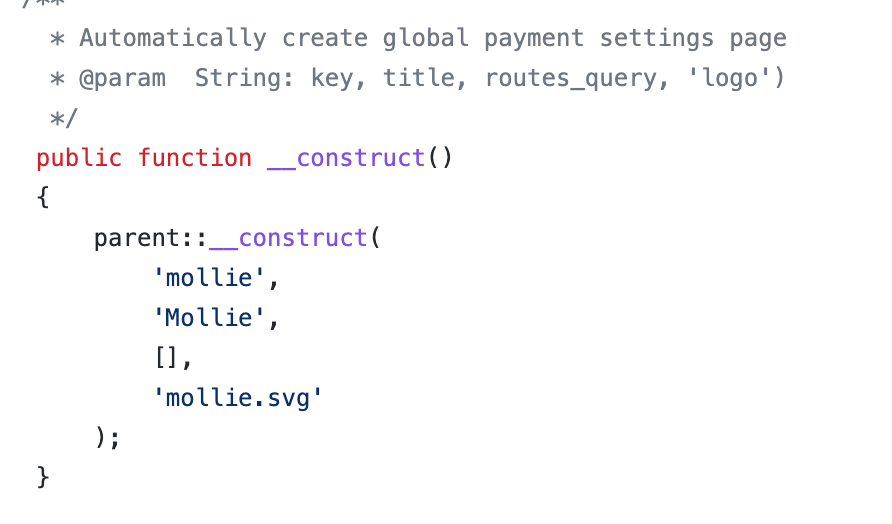
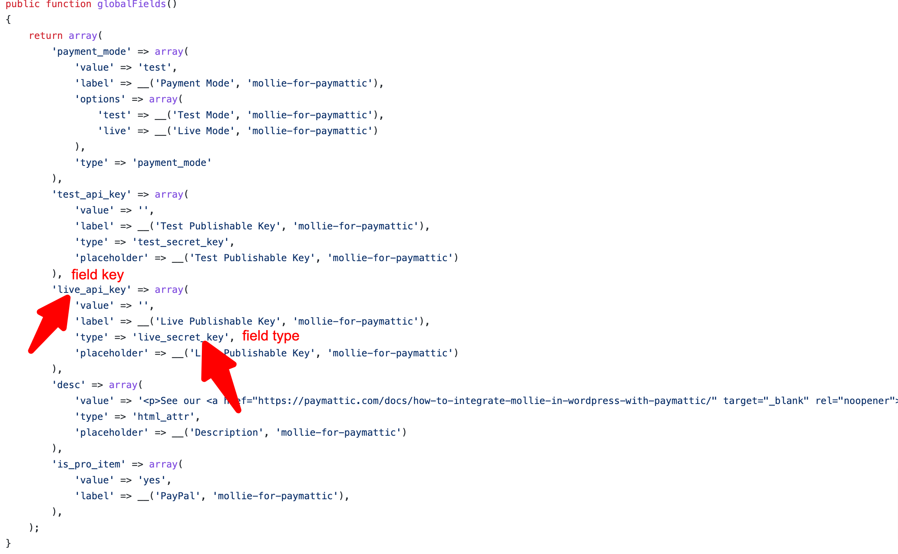
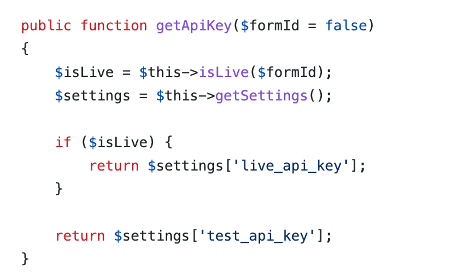

# mollie-for-paymattic
An example plugin for Paymattic payment module integrations.

# procedure of integrating a custom payment module with paymattic
Here we tried to show how to integrate a custom payment gateway with paymattic by showcasing payment gateway integration.
As we did this demo with <b>mollie</b> payment gateway make sure you replace mollie with your <b>custom payment name </b> in all the hooks you find across all the files.

ex: add_action('wppayform/form_submission_make_payment_mollie', array($this, 'makeFormPayment'), 10, 6); wiil be add_action('wppayform/form_submission_make_payment_custom_payment', array($this, 'makeFormPayment'), 10, 6);

## module structure
- plugin file
- settings
- Api

### sample_payment_file.php
In the main plugin file of the custom payment you need to do some mandatory checks and use the desired <b>wppayform_loaded</b> hook to trigger integrating your custome module. 

Go through the <b>mollie-for-paymattic.php</b> file to get it clear.

### settings directory
To make your custom payment compatible and visible in paymattic you need to provide desired settings in a specific way. Setting constructed with two defferent file
- Element.php
- Settings.php

#### Element.php file
Element.php file where you make your custom payment as a paymattic component. This file basically extend the BaseComponent file of Paymattic and add the 
necessary hooks in the construct menthod.

 

Go through the <b>settings/MollieElement.php</b> and do exactly by replacing your custom payment name.

#### settings.php file

In <b>__construct</b> method you need to pass key(which will beused as the method name), title, routes_query (keep it emtpy array), logo to create a global setting page. Do that by replaceing mollie with your custom payment in the same format.

settings.php file where you give all necessary global fileds to save the payments credentials: live/test public/secret keys to make your payment module actually works. This file need to extend the basepayment class of paymattic. implements all the function by replacing yours.

In this file where you need to be little bit more careful is the <b>globalFields</b> method.

 

There are four, two(in some case, as here in mollie) credential fields <b>type</b>.
- test_secret_key
- test_pub_key
- live_secret_key
- live_pub_key

Field type must be exact same. [ex: if you need test api key/test secret key] in both case you should provide field type as test_secret_key.

But field key and label of credential fields you can give as your payment module requires. ex: for mollie you need <b>test_api_key</b> and <b>live_api_key</b>. In other case they can test token/live token or test secret/ live secret etc.

Make sure you try to access same key in (get/validate api) methods as you set keys on global fields.

rest, implement all the methods as given on <b>settings/settings.php</b> and replace with your necessary settings but keep the format same.

### API directory
To process payments you needs api interaction and in some payment gateway you need ipn setup.
- Process file
- IPN file

#### process.php file
All the primary and main payment process happens in this file.
##### methods
- init (trigger all the necessary hooks and methods)
- getPaymentMode 
- addTransactionUrl
- choosePaymentMethod (wiil select this payment  method if selected by user)
- makeFormPayment (start payment process by triggering handleredirect)
- getSuccessURL (return the success url we get form formConfirmationsettings where we nned to redirect the user after successful transaction)
- handleRedirect (take user to the payment gateway page with all necessary arguments ex: stripe checkout page)
- handlePaid (checks if it paid or not)
- handleRefund (handaling the refund here)
- getLastTransaction
- markAsPaid
- validateSubscription (If your payment have subscription option it will validate the subscription)

Implements all the methods of MollieProcessor.php as exact, you may need to make slight changes only where you find mollie is indicated.

#### IPN.php file
Most of the payment mehtod require ipn(Instant payment notification) setup to make payment smooth, secure and reliable such as paypal, mollie , stripe uses ipn.

##### methods
- verifyIPN (after recieviing an ipn through our provided webhook it verifies if it is a real and authenticated ipn from desired payment gateway)
- handleIpn (Handle the 
- makeApiCall (Where it makes the api call with all the necessary authorization keys and arguments for any kind of payment api interaction) you can 

Implement all the methods of <b>API/IPN.php</b> file as usual and replace <b>mollie</b> with your cutom payment.

That's it You just integrated a cutom payment module with payment. :relaxed:

